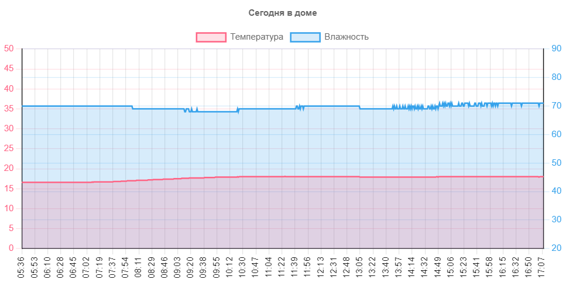

# Монитор телеметрии

*Сразу отмечу, что сервис пока сыроват, работы продолжаются.*

Работает здесь: [http://alexpolkin.tech/charts/today.html](http://alexpolkin.tech/charts/today.html), но может и переедет.

## О чём вообще это
Микроконтроллер ESP8266 с помощью модуля DHT11 раз в минуту измеряет температуру и влажность на некотором удалённом объекте. Данные по Wi-Fi и далее по мобильному интернету отправляются на сервер с бесплатным хостингом. Там они аккуратно складываются в БД PostgreSQL и по запросу оттуда вытягиваются. А благодаря JS библиотеке Chart.js страница формирует приятный график.

## Используемые технологии:
- Arduino C (код для микроконтроллера)
- JSON (формат для обмена данными телеметрии)
- PHP (код для обработки запросов на сервере)
- PostgreSQL (хранение данных телеметрии)
- AXIOS (JS библиотека для получения JSON клиентом)
- Char.js (JS библиотека для рисования красивых графиков)
- JavaScript, CSS, HTML (формирование страницы в браузере)

## Инструменты
- VSCode
- DBeaver
- Postman

## В планах
- Сделать навигацию по заданным интервалам времени (часы, дни, недели)
- Уведомление в Telegram по критическим событиям: задымление, резкое изменение температуры и/или влажности, обнаружение движения (уже частично работает в непубличной версии)
- Заменить модуль DHT11 на более современный DHT22
- Добавить веб-интерфейс для удалённого управления исполнительными устройствами
- Улучшить внешний вид, ну и причесать код